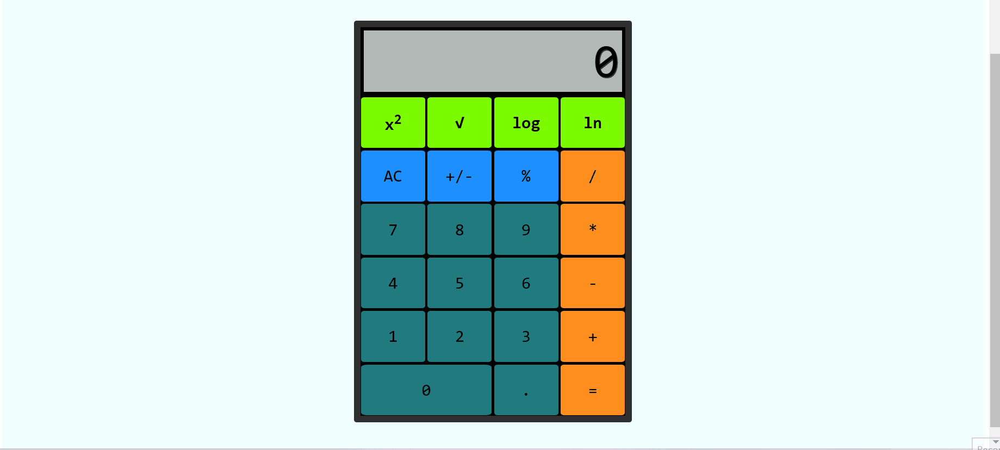

#### Name: Dayaan Mazhar
#### Z23529142
#
# 
**Calculator**

## Description
The buttons and their functionality that was added to the calculator include:
* x2 - Calculates power of 2 of a number 
* $\sqrt{}$ - Calculates square root of a number
* log x - Calculates log base 10 of a number
* ln x - Calculates natural log of a number
#
## Video Demo
Here is a gif showing the implementation of the calculator:

  
Here is another gif showing the updated functionality of the calculator such as doing calculations like 2 times 22222 or 333*33333 or even something simple as 40 - 10. Also, these operations are being done by using the keyboard keys only:
  
