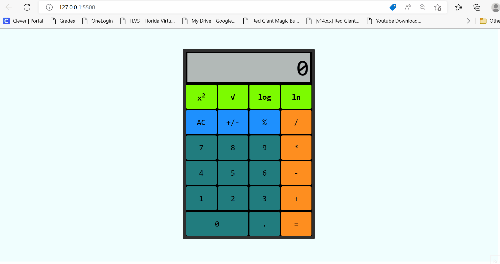

#### Name: Dayaan Mazhar
#### Z23529142
#
# 
**Calculator**

## Description
The buttons and their functionality that was added to the calculator include:
* x2 - Calculates power of 2 of a number 
* $\sqrt{}$ - Calculates square root of a number
* log x - Calculates log base 10 of a number
* ln x - Calculates natural log of a number
#
## Video Demo
Here is a gif showing the implementation of the calculator:

